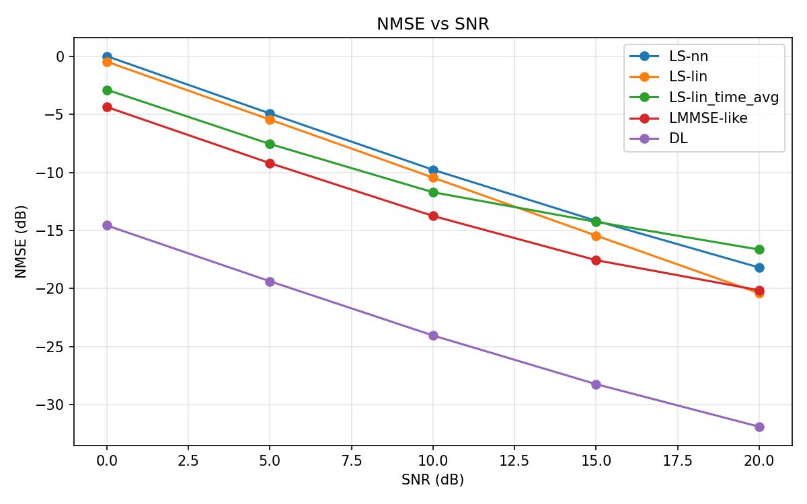
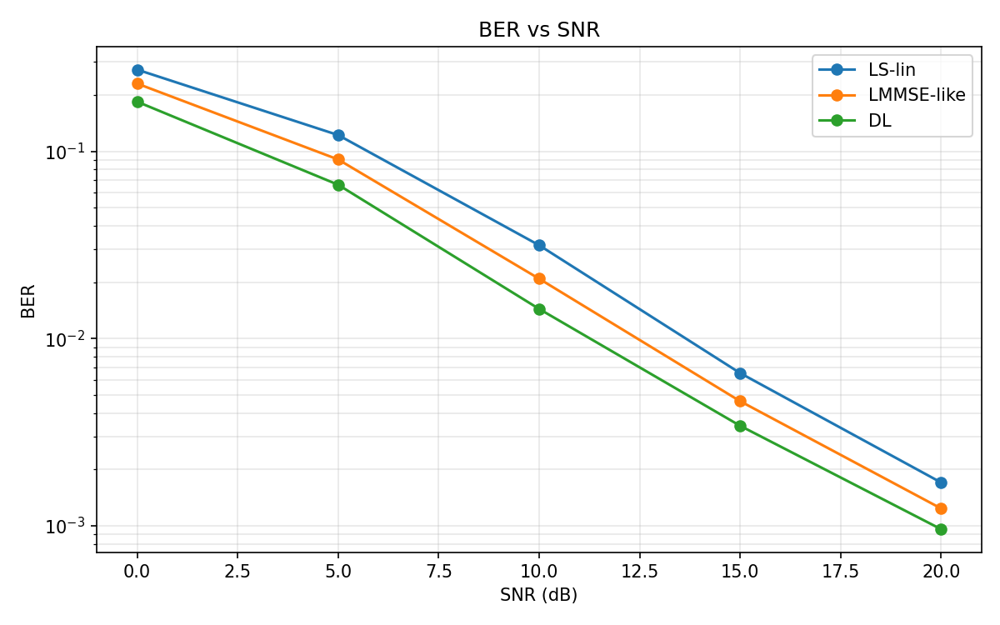

# CDL-C SISO Baseline Results

## 1. Experiment Summary

This experiment benchmarks the same residual CNN channel estimator under a more realistic `CDL-C` propagation model using `Sionna 2.0.1 + PyTorch 2.9.1`.

- Task: SISO OFDM channel estimation
- Channel: `CDL-C`
- Grid: `14 OFDM symbols x 256 subcarriers`
- Pilots: OFDM symbols `{2, 11}`, `kronecker` pilot pattern
- Modulation: `QPSK`
- Mobility: `10 m/s`
- Input to the neural estimator: `LS-lin`
- Output of the neural estimator: residual correction on top of `LS-lin`
- Model: lightweight residual CNN
- Trainable parameters: `593,218`

Runtime and implementation status:

- Real backend validated in WSL2 on `NVIDIA GeForce RTX 4060 Laptop GPU`
- Dataset, training, and evaluation were all run on native WSL ext4 storage
- Best checkpoint was found at `epoch 49`
- The `50`-epoch budget ended before early stopping triggered, which suggests the `CDL-C` baseline still had room to improve with a longer run
- Native WSL storage sustained about `46 samples/s` during the later training epochs

## 2. Dataset and Evaluation Setup

Dataset size from the current baseline configuration:

- Train: `8` shards x `256` samples = `2,048` examples
- Validation: `2` shards x `256` samples = `512` examples
- Test: `2` shards x `256` samples = `512` examples

Compared methods:

- `LS-nn`
- `LS-lin`
- `LS-lin_time_avg`
- `LMMSE-like` smoothing baseline
- `DL` residual CNN estimator

Evaluation SNRs:

- `0, 5, 10, 15, 20 dB`

## 3. Main Results

### NMSE (dB)

| SNR (dB) | LS-nn | LS-lin | LS-lin_time_avg | LMMSE-like | DL |
| --- | ---: | ---: | ---: | ---: | ---: |
| 0  | 0.02 | -0.46 | -2.88 | -4.37 | **-14.57** |
| 5  | -4.93 | -5.45 | -7.55 | -9.20 | **-19.38** |
| 10 | -9.77 | -10.45 | -11.71 | -13.75 | **-24.05** |
| 15 | -14.17 | -15.45 | -14.26 | -17.56 | **-28.25** |
| 20 | -18.20 | -20.42 | -16.65 | -20.16 | **-31.92** |

### BER

| SNR (dB) | LS-lin | LMMSE-like | DL |
| --- | ---: | ---: | ---: |
| 0  | 2.732e-1 | 2.301e-1 | **1.842e-1** |
| 5  | 1.222e-1 | 9.051e-2 | **6.634e-2** |
| 10 | 3.153e-2 | 2.089e-2 | **1.441e-2** |
| 15 | 6.549e-3 | 4.635e-3 | **3.425e-3** |
| 20 | 1.705e-3 | 1.239e-3 | **9.604e-4** |

## 4. Figure Interpretation

### NMSE curve



Interpretation:

- The `DL` estimator outperforms `LS-lin` at every evaluated SNR under the `CDL-C` channel model.
- At `10 dB`, `DL` improves NMSE by about `13.60 dB` over `LS-lin`.
- At `20 dB`, `DL` improves NMSE by about `11.50 dB` over `LS-lin`.
- Relative to the `LMMSE-like` baseline, `DL` improves NMSE by about `10.30 dB` at `10 dB` and `11.76 dB` at `20 dB`.
- Compared with the earlier `TDL-C` run, the learned estimator remains strong under the richer angular structure of `CDL-C`, which is a good sign for robustness beyond simpler tapped-delay models.

### BER curve



Interpretation:

- Channel-estimation gains still translate into better symbol recovery under `CDL-C`.
- At `10 dB`, BER drops from `3.15e-2` (`LS-lin`) to `1.44e-2` (`DL`), which is about `54.3%` lower.
- At `20 dB`, BER drops from `1.71e-3` (`LS-lin`) to `9.60e-4` (`DL`), which is about `43.7%` lower.
- Relative to `LMMSE-like`, `DL` reduces BER by about `31.0%` at `10 dB` and `22.5%` at `20 dB`.
- This matters because `CDL-C` is a harder and more realistic channel family than the original `TDL-C` baseline, yet the learned estimator still produces consistent downstream gains.

## 5. GitHub-Ready Summary

Short project summary:

> Extended the OFDM channel-estimation benchmark from `TDL-C` to `CDL-C` using `Sionna 2.0.1`, and trained a residual CNN that improved NMSE by `13.6 dB` and reduced BER by about `54%` over `LS-lin` at `10 dB` SNR on the current SISO setup.

Suggested repository highlight bullets:

- Upgraded the baseline from `TDL-C` to the more realistic `CDL-C` fading model without changing the high-level training pipeline
- Verified that the same residual CNN remains effective under a richer channel model
- Preserved end-to-end evaluation with both `NMSE` and `BER`
- Confirmed that training had not yet plateaued by `epoch 50`, indicating further headroom

## 6. Resume-Ready Bullets

Chinese version:

- 将 OFDM 信道估计基线从 `TDL-C` 扩展到更真实的 `CDL-C` 信道模型，并在原有 `Sionna + PyTorch` 管线下完成数据生成、训练与 `NMSE/BER` 评估。
- 在 `14x256` 的 SISO OFDM 资源栅格上，深度学习估计器相较 `LS-lin` 在 `10 dB` SNR 处实现约 `13.6 dB` 的 `NMSE` 提升，并将 `BER` 从 `3.15e-2` 降至 `1.44e-2`，相对下降约 `54%`。
- `CDL-C` 训练在 `50` 个 epoch 内仍未明显饱和，最佳点出现在 `epoch 49`，说明更长训练和更强模型仍有继续提升空间。

English version:

- Extended the OFDM channel-estimation benchmark from `TDL-C` to the more realistic `CDL-C` fading model while preserving the same `Sionna + PyTorch` training pipeline.
- On a `14x256` SISO OFDM grid, the learned estimator improved `NMSE` by `13.6 dB` over `LS-lin` at `10 dB` SNR and reduced `BER` by about `54%`.
- The `CDL-C` run was still improving near `epoch 50`, suggesting additional headroom from longer training or larger models.

## 7. Report-Ready Discussion

Recommended narrative for a report or presentation:

1. Position `CDL-C` as the next realism step after `TDL-C`, because it introduces richer spatial and angular structure.
2. Highlight that the same residual CNN architecture continued to work without redesigning the entire estimator.
3. Use `NMSE` to show estimation quality and `BER` to show receiver-level impact.
4. Emphasize that the gap over `LS` and `LMMSE-like` baselines remains wide even under the more difficult channel model.
5. State the main limitation honestly: this is still a `SISO` benchmark, and the next structural step is `2x2 MIMO`.

## 8. Reproducibility

Environment:

- WSL2 Ubuntu
- `Sionna 2.0.1`
- `torch 2.9.1`
- `mitsuba 3.8.0`
- `drjit 1.3.1`

Main commands:

```bash
generate_dataset --config configs/cdl_c_siso_wsl_local.toml
train_cnn --config configs/cdl_c_siso_wsl_local.toml
eval_nmse --config configs/cdl_c_siso_wsl_local.toml
eval_ber --config configs/cdl_c_siso_wsl_local.toml
```

Result artifacts:

- Native WSL checkpoint root: `/home/wiseung/ofdm_channel_estimation_runs/cdl_c_siso_baseline/checkpoints`
- Native WSL eval root: `/home/wiseung/ofdm_channel_estimation_runs/cdl_c_siso_baseline/eval`
- Figures copied for GitHub rendering: `docs/figures/cdl_c_nmse_curve.png`, `docs/figures/cdl_c_ber_curve.png`

## 9. Limitations and Next Steps

- The current `CDL-C` baseline did not trigger early stopping within the `50`-epoch budget.
- The current `LMMSE-like` baseline is still a lightweight smoothing surrogate, not a full covariance-driven implementation.
- The next highest-value extension is to carry the now-validated pipeline into `2x2 MIMO` and then recover a proper multi-stream BER path.
