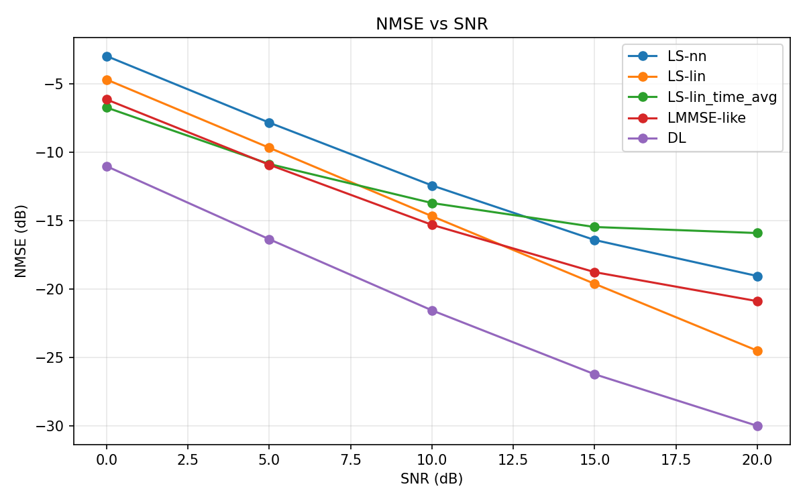
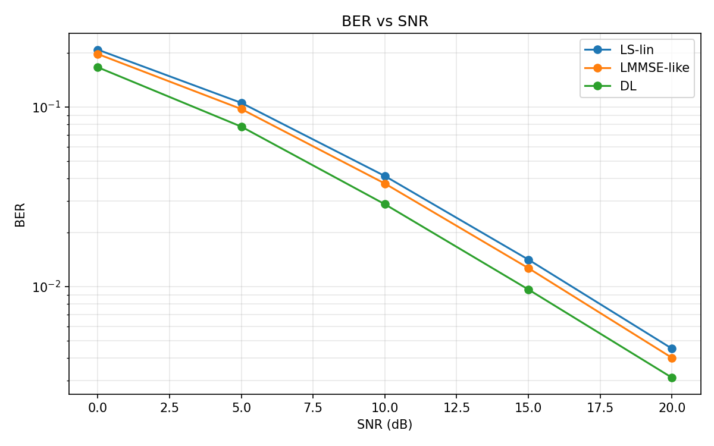

# 2x2 MIMO TDL-C Baseline Results

## 1. Experiment Summary

This experiment extends the baseline from `SISO` to a `2x2 MIMO` OFDM link using `Sionna 2.0.1 + PyTorch 2.9.1`.

- Task: `2x2 MIMO` OFDM channel estimation and detection
- Channel: `TDL-C`
- Grid: `14 OFDM symbols x 256 subcarriers`
- Pilots: OFDM symbols `{2, 11}`, `kronecker` pilot pattern
- Modulation: `QPSK`
- Mobility: `10 m/s`
- Spatial setup:
  - `num_tx = 1`
  - `num_streams_per_tx = 2`
  - `num_tx_ant = 2`
  - `num_rx_ant = 2`
- Neural estimator input: flattened `LS-lin`
- Neural estimator output: residual correction on top of `LS-lin`
- Model: lightweight residual CNN with `8` input channels and `8` output channels
- Trainable parameters: `600,136`

Implementation notes:

- Multi-antenna channel tensors are flattened into `8` real-valued channels (`4` complex links split into real/imag).
- Multi-stream BER evaluation uses `Sionna OFDM LMMSEEqualizer + Demapper`, not a hand-written stream ordering.
- The stable long run only became reliable after moving the repo itself into WSL-local storage and launching from there instead of `/mnt/g`.

## 2. Runtime and Training Status

Runtime:

- WSL2 Ubuntu
- `Sionna 2.0.1`
- `torch 2.9.1`
- GPU: `NVIDIA GeForce RTX 4060 Laptop GPU`

Training status:

- The first long-run attempts surfaced two environment issues:
  - `DataLoader` workers could trigger host-memory pressure when decompressing large `npz` shards in parallel
  - long training launched from `/mnt/g` could destabilize the WSL/Windows `9p` path
- After moving the repo itself to WSL-local storage and using `num_workers = 0`, the `2x2 MIMO` run completed successfully.
- The final training log reached `epoch 34`.
- Best validation NMSE was observed at `epoch 26` with `val NMSE = -21.55 dB`.
- Early stopping then terminated training after the patience window expired.

## 3. Dataset and Evaluation Setup

Dataset size:

- Train: `8` shards x `256` samples = `2,048` examples
- Validation: `2` shards x `256` samples = `512` examples
- Test: `2` shards x `256` samples = `512` examples

Compared methods:

- `LS-nn`
- `LS-lin`
- `LS-lin_time_avg`
- `LMMSE-like`
- `DL` residual CNN estimator

Evaluation SNRs:

- `0, 5, 10, 15, 20 dB`

## 4. Main Results

### NMSE (dB)

| SNR (dB) | LS-nn | LS-lin | LS-lin_time_avg | LMMSE-like | DL |
| --- | ---: | ---: | ---: | ---: | ---: |
| 0  | -2.95 | -4.67 | -6.71 | -6.12 | **-11.01** |
| 5  | -7.82 | -9.66 | -10.85 | -10.90 | **-16.35** |
| 10 | -12.41 | -14.66 | -13.70 | -15.29 | **-21.55** |
| 15 | -16.40 | -19.61 | -15.45 | -18.76 | **-26.23** |
| 20 | -19.04 | -24.50 | -15.90 | -20.88 | **-30.00** |

### BER

| SNR (dB) | LS-lin | LMMSE-like | DL |
| --- | ---: | ---: | ---: |
| 0  | 2.086e-1 | 1.973e-1 | **1.665e-1** |
| 5  | 1.055e-1 | 9.747e-2 | **7.777e-2** |
| 10 | 4.129e-2 | 3.750e-2 | **2.876e-2** |
| 15 | 1.414e-2 | 1.268e-2 | **9.641e-3** |
| 20 | 4.518e-3 | 4.017e-3 | **3.115e-3** |

## 5. Figure Interpretation

### NMSE curve



Interpretation:

- The `DL` estimator outperforms `LS-lin` across the evaluated SNR range.
- At `10 dB`, `DL` improves NMSE by about `6.89 dB` over `LS-lin`.
- At `20 dB`, `DL` improves NMSE by about `5.50 dB` over `LS-lin`.
- `LMMSE-like` remains competitive in parts of the curve, but the learned model still wins clearly at medium and high SNR.
- The gap is smaller than the `SISO` case, which is expected: the `2x2 MIMO` problem is harder, the channel tensor is larger, and the current network is still a relatively lightweight baseline.

### BER curve



Interpretation:

- BER improvements are preserved after adding multi-stream equalization and demapping.
- At `10 dB`, BER drops from `4.13e-2` (`LS-lin`) to `2.88e-2` (`DL`), a relative reduction of about `30.3%`.
- At `20 dB`, BER drops from `4.52e-3` (`LS-lin`) to `3.11e-3` (`DL`), a relative reduction of about `31.1%`.
- Relative to `LMMSE-like`, the BER gains are smaller but still positive: about `23.3%` at `10 dB` and `22.5%` at `20 dB`.
- This is an important milestone because the pipeline now supports a genuine multi-stream BER path instead of only SISO demapping.

## 6. GitHub-Ready Summary

Short project summary:

> Extended the OFDM channel-estimation benchmark from `SISO` to a `2x2 MIMO` link using `Sionna 2.0.1`, implemented a multi-stream `LMMSE` equalization + demapping path, and trained a residual CNN that improved NMSE by `6.9 dB` and reduced BER by about `30%` over `LS-lin` at `10 dB` SNR.

Suggested repository highlight bullets:

- First successful `2x2 MIMO` version of the pipeline, not just a SISO port
- Multi-stream BER path validated with `Sionna OFDM LMMSEEqualizer + Demapper`
- End-to-end training and evaluation stabilized by moving the repo and runtime fully into WSL-local storage
- Measurable gains over classical interpolation baselines in both `NMSE` and `BER`

## 7. Resume-Ready Bullets

Chinese version:

- 将 OFDM 信道估计管线从 `SISO` 扩展到 `2x2 MIMO`，打通了多流信道估计、`LMMSE` 等化和硬判决解调的完整评估链路。
- 在 `2x2 MIMO TDL-C` 场景下，深度学习估计器在 `10 dB` SNR 处相较 `LS-lin` 实现约 `6.9 dB` 的 `NMSE` 提升，并将 `BER` 从 `4.13e-2` 降至 `2.88e-2`，相对下降约 `30%`。
- 通过将源码仓库和运行环境迁移到 WSL 本地磁盘，规避了 `/mnt/g` 路径下的 `9p` 挂载不稳定问题，使 `2x2 MIMO` 长跑可以稳定完成。

English version:

- Extended the OFDM channel-estimation pipeline from `SISO` to `2x2 MIMO`, including a complete multi-stream channel-estimation, `LMMSE` equalization, and hard-decision demapping path.
- On the current `2x2 MIMO TDL-C` benchmark, the learned estimator improved `NMSE` by `6.9 dB` over `LS-lin` at `10 dB` SNR and reduced `BER` by about `30%`.
- Stabilized the long-run workflow by moving both the repo and runtime fully into WSL-local storage, avoiding the `/mnt/g` `9p` mount instability.

## 8. Reproducibility

Environment:

- WSL2 Ubuntu
- `Sionna 2.0.1`
- `torch 2.9.1`
- `mitsuba 3.8.0`
- `drjit 1.3.1`

Main commands:

```bash
generate_dataset --config configs/mimo_2x2_wsl_local.toml
train_cnn --config configs/mimo_2x2_wsl_local.toml
eval_nmse --config configs/mimo_2x2_wsl_local.toml
eval_ber --config configs/mimo_2x2_wsl_local.toml
```

Result artifacts:

- Checkpoints: `/home/wiseung/ofdm_channel_estimation_runs/mimo_2x2_baseline/checkpoints`
- Evaluation results: `/home/wiseung/ofdm_channel_estimation_runs/mimo_2x2_baseline/eval`
- GitHub-renderable figures: `docs/figures/mimo_2x2_nmse_curve.png`, `docs/figures/mimo_2x2_ber_curve.png`

## 9. Limitations and Next Steps

- The current `2x2 MIMO` baseline uses a flattened channel representation and the same lightweight CNN backbone style used in SISO. A more structure-aware MIMO model should improve further.
- `LMMSE-like` in the NMSE table is still the lightweight smoothing proxy, while BER uses the proper `Sionna` `LMMSEEqualizer`.
- The next highest-value extension is to take this now-stable `2x2 MIMO` path from `TDL-C` to `CDL-C`.
