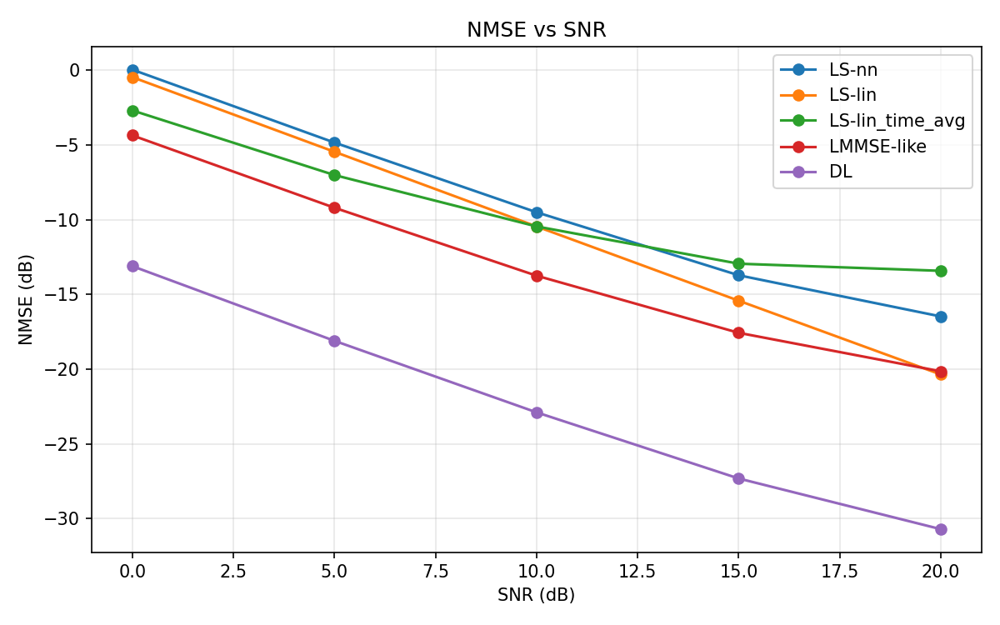
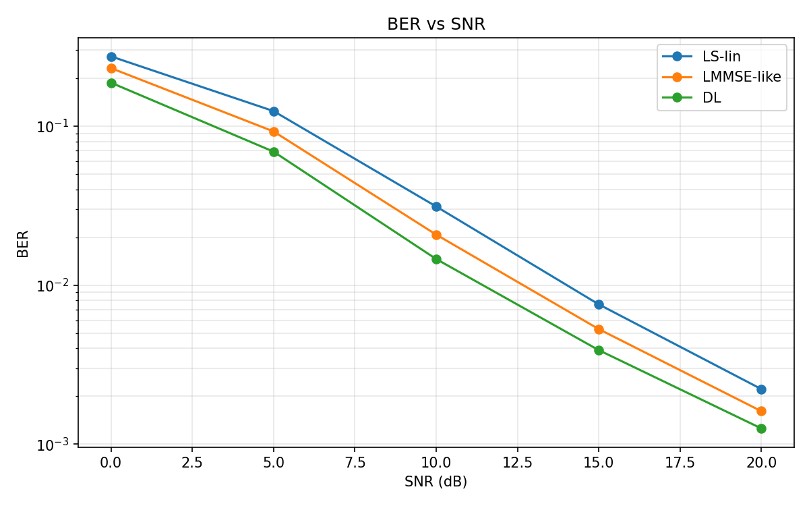

# TDL-C SISO Baseline Results

## 1. Experiment Summary

This experiment benchmarks a deep-learning OFDM channel estimator built with `Sionna 2.0.1 + PyTorch 2.9.1`.

- Task: SISO OFDM channel estimation
- Channel: `TDL-C`
- Grid: `14 OFDM symbols x 256 subcarriers`
- Pilots: OFDM symbols `{2, 11}`, `kronecker` pilot pattern
- Modulation: `QPSK`
- Mobility: `10 m/s`
- Input to the neural estimator: `LS-lin`
- Output of the neural estimator: residual correction on top of `LS-lin`
- Model: lightweight residual CNN
- Trainable parameters: `593,218`

Runtime and implementation status:

- Real backend validated in WSL2 on `NVIDIA GeForce RTX 4060 Laptop GPU`
- Dataset generated with the real `Sionna` backend
- The initial checkpoint was obtained on `/mnt/g`
- Training was then migrated to native WSL ext4 storage and resumed through the full early-stopping window
- The resumed run continued to `epoch 25`; the best checkpoint remained at `epoch 17`, which confirms the baseline had already plateaued
- Training throughput on native WSL storage was about `42-46 samples/s`, materially faster than the mounted Windows filesystem path

## 2. Dataset and Evaluation Setup

Dataset size from the current baseline configuration:

- Train: `8` shards x `256` samples = `2,048` examples
- Validation: `2` shards x `256` samples = `512` examples
- Test: `2` shards x `256` samples = `512` examples

Compared methods:

- `LS-nn`
- `LS-lin`
- `LS-lin_time_avg`
- `LMMSE-like` smoothing baseline
- `DL` residual CNN estimator

Evaluation SNRs:

- `0, 5, 10, 15, 20 dB`

## 3. Main Results

### NMSE (dB)

| SNR (dB) | LS-nn | LS-lin | LS-lin_time_avg | LMMSE-like | DL |
| --- | ---: | ---: | ---: | ---: | ---: |
| 0  | 0.05 | -0.45 | -2.68 | -4.35 | **-13.11** |
| 5  | -4.83 | -5.45 | -7.01 | -9.20 | **-18.11** |
| 10 | -9.50 | -10.45 | -10.45 | -13.74 | **-22.89** |
| 15 | -13.72 | -15.42 | -12.94 | -17.57 | **-27.32** |
| 20 | -16.47 | -20.36 | -13.42 | -20.15 | **-30.72** |

### BER

| SNR (dB) | LS-lin | LMMSE-like | DL |
| --- | ---: | ---: | ---: |
| 0  | 2.740e-1 | 2.312e-1 | **1.872e-1** |
| 5  | 1.241e-1 | 9.246e-2 | **6.900e-2** |
| 10 | 3.120e-2 | 2.077e-2 | **1.459e-2** |
| 15 | 7.567e-3 | 5.291e-3 | **3.901e-3** |
| 20 | 2.220e-3 | 1.612e-3 | **1.256e-3** |

## 4. Figure Interpretation

### NMSE curve



Interpretation:

- The `DL` estimator outperforms `LS-lin` at every evaluated SNR.
- At `10 dB`, `DL` improves NMSE by about `12.45 dB` over `LS-lin`.
- At `20 dB`, `DL` improves NMSE by about `10.36 dB` over `LS-lin`.
- `DL` also outperforms the current `LMMSE-like` baseline by about `9.15 dB` at `10 dB` and `10.57 dB` at `20 dB`.
- The gap remains large across the full SNR range, which indicates the residual CNN is learning a meaningful refinement of the pilot-interpolated estimate instead of only fitting low-SNR noise.

### BER curve



Interpretation:

- The `DL` estimator also translates channel-estimation gains into better detection performance.
- At `10 dB`, BER drops from `3.12e-2` (`LS-lin`) to `1.46e-2` (`DL`), which is about `53.3%` lower.
- At `20 dB`, BER drops from `2.22e-3` (`LS-lin`) to `1.26e-3` (`DL`), which is about `43.4%` lower.
- Relative to `LMMSE-like`, `DL` still reduces BER by about `29.8%` at `10 dB` and `22.1%` at `20 dB`.
- This is the more important practical signal for receiver design: the learned estimator improves not just NMSE, but also downstream symbol recovery.

## 5. GitHub-Ready Summary

Short project summary:

> Built a real-backend OFDM channel-estimation benchmark with `Sionna 2.0.1 + PyTorch 2.9.1`, generated `TDL-C` channel data on GPU, and trained a residual CNN to refine `LS-lin` estimates. On the current SISO baseline, the learned estimator improved NMSE by `12.4 dB` at `10 dB` SNR and reduced BER by about `53%` relative to `LS-lin`.

Suggested repository highlight bullets:

- Real wireless channel data generation with `Sionna` instead of a hand-written toy simulator
- End-to-end benchmark covering data generation, `LS` baselines, CNN training, `NMSE` evaluation, and `BER` validation
- Verified GPU runtime in WSL2 on consumer hardware (`RTX 4060 Laptop GPU`)
- Training successfully resumed on native WSL storage, confirming the `epoch 17` checkpoint as the stable optimum
- Clear measurable gain over classical pilot interpolation baselines

## 6. Resume-Ready Bullets

Chinese version:

- 基于 `Sionna 2.0.1 + PyTorch 2.9.1` 搭建 OFDM 无线信道估计实验基线，完成真实 `TDL-C` 信道数据生成、`LS/LMMSE` 基线、残差 CNN 训练与 `NMSE/BER` 闭环评估。
- 在 `14x256` 的 SISO OFDM 资源栅格上，深度学习估计器相较 `LS-lin` 在 `10 dB` SNR 处实现约 `12.4 dB` 的 `NMSE` 提升，并将 `BER` 从 `3.12e-2` 降至 `1.46e-2`，相对下降约 `53%`。
- 将训练从 `/mnt/g` 迁移到 WSL 本地 ext4 存储后，续训速度显著提升，并验证最佳 checkpoint 仍稳定停留在 `epoch 17`。

English version:

- Built a reproducible OFDM channel-estimation benchmark with `Sionna 2.0.1 + PyTorch 2.9.1`, covering real `TDL-C` channel data generation, `LS/LMMSE` baselines, residual CNN training, and end-to-end `NMSE/BER` evaluation.
- On a `14x256` SISO OFDM grid, the learned estimator improved `NMSE` by `12.4 dB` over `LS-lin` at `10 dB` SNR and reduced `BER` by about `53%`.
- Validated the full GPU runtime on an `RTX 4060 Laptop GPU`, migrated training to native WSL storage for faster continuation, and delivered a CLI-driven, repo-ready experiment workflow.

## 7. Report-Ready Discussion

Recommended narrative for a report or presentation:

1. Start from the engineering problem: sparse pilots make direct interpolation fragile under realistic fading.
2. Explain the modeling choice: treat the complex channel grid as a two-channel image and learn a residual correction to `LS-lin`.
3. Use `NMSE` to show estimator quality and `BER` to show receiver-level value.
4. Emphasize that gains persist across all tested SNR points, not only at one cherry-picked operating point.
5. State the current limitation honestly: this is a strong SISO baseline, but not yet the final system paper result. The next steps are `CDL-C`, `2x2 MIMO`, and stronger covariance-aware baselines.

## 8. Reproducibility

Environment:

- WSL2 Ubuntu
- `Sionna 2.0.1`
- `torch 2.9.1`
- `mitsuba 3.8.0`
- `drjit 1.3.1`

Main commands:

```bash
generate_dataset --config configs/baseline_wsl_local.toml
train_cnn --config configs/baseline_wsl_local.toml
eval_nmse --config configs/baseline_wsl_local.toml
eval_ber --config configs/baseline_wsl_local.toml
```

Result artifacts:

- Native WSL checkpoint root: `/home/wiseung/ofdm_channel_estimation_runs/tdl_c_siso_baseline/checkpoints`
- Native WSL eval root: `/home/wiseung/ofdm_channel_estimation_runs/tdl_c_siso_baseline/eval`
- Figures copied for GitHub rendering: `docs/figures/nmse_curve.png`, `docs/figures/ber_curve.png`

## 9. Limitations and Next Steps

- The current best checkpoint remained `epoch 17` even after the native-WSL continuation run, which suggests the present architecture and dataset size may already be near their plateau.
- The current `LMMSE-like` baseline is a lightweight smoothing surrogate, not a fully covariance-driven textbook LMMSE implementation.
- The next highest-value extension is to scale this verified SISO pipeline to `CDL-C`, then to `2x2 MIMO`, and finally to high-mobility attention-based models.
